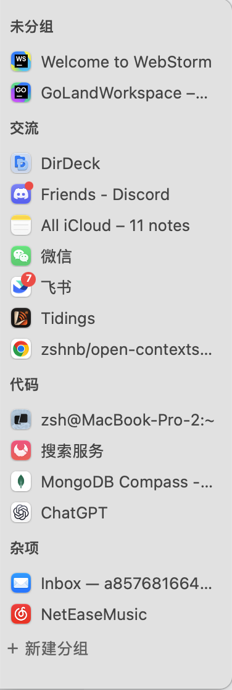
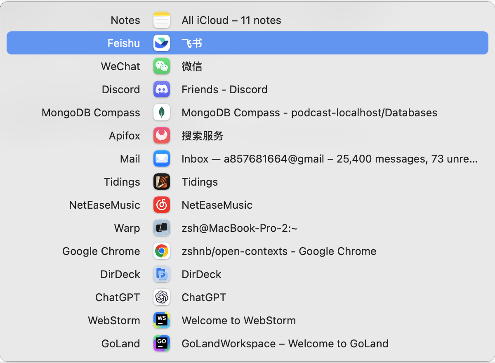

**English** | [简体中文](README.zh-CN.md)

<h1 align="center"> Open Contexts — Free, open-source Mac window switcher</h1>

Open Contexts is a **free, open-source window switcher for macOS** with app-name and window-title search, a persistent app bar, and saved window groups. Use `⌘Tab` to switch between individual windows, organize them by task in the sidebar, and customize your keyboard shortcuts. All features are included, with no account or subscription.

[Download for macOS](https://github.com/zshnb/open-contexts/releases/latest) · [Official website](https://opencontexts.zshnb.com/) · [How to switch between windows on Mac](https://opencontexts.zshnb.com/guides/switch-between-windows-on-mac/) · [Compare Mac window switchers](https://opencontexts.zshnb.com/compare/)

## Switch between windows on Mac

- **Select a window directly.** macOS `⌘Tab` switches between apps; Open Contexts lists individual windows in most recently used order, including multiple windows from the same app.
- **Keep windows within reach.** Place the app bar on the left, right, or bottom edge of the screen, always visible or revealed when the pointer reaches the edge.
- **Organize windows by task.** Create groups for coding, research, or chat. Drag windows into groups, pin their order, and retain your groups after restarting the app.

## Screenshots

Actual screenshots of the macOS app.

### Left sidebar



The left and right sidebars are centered along the edge of the screen.

### Bottom bar


The bottom bar lays out windows from left to right and is centered as a whole. When space is limited, each window item shrinks evenly so all windows fit on one line.

### Window switcher



The window switcher displays windows in most recently used order. You can continue selecting and switching with the keyboard.

## Mac window switcher features

| Feature | How it works |
| --- | --- |
| Window switching | Displays and switches individual windows rather than apps, and tracks most recently used (MRU) order |
| Screen edge sidebar | Supports the left, right, or bottom edge; always visible or shown when the pointer reaches the screen edge; optionally shows icons alone or icons with titles |
| Keyboard switcher | Defaults to `⌘Tab` for all windows and `Command + backtick` for the current app; both shortcuts are customizable in Settings; supports Shift for reverse switching, arrow keys, `Esc`, and releasing a shortcut modifier to confirm |
| Window search | Search by app name or window title: hold the switcher modifier, type, then release to switch; matches are highlighted in yellow |
| Window activation | Attempts to restore minimized or hidden windows when activated |
| Window information | Displays app icons, window titles, and notification badges readable from the system Dock |
| Native macOS app | Built with Swift, AppKit, and SwiftUI; app updates use Sparkle |

### Saved window groups

Keep related windows together in the sidebar, even when they belong to different apps:

- Create, rename, and delete groups; drag windows or groups to reorder them.
- Right-click a window and select “Pin” to keep it at its current position in the group during automatic updates; drag it to change that position.
- Restore group names and order after a restart, along with the group, order, and sidebar position of windows that can be matched.

Saved groups organize the window list; they do not reopen apps or restore desktop window sizes and positions.

### Looking for a Contexts or AltTab alternative?

Open Contexts recreates the app bar and window switcher experience of [Contexts](https://contexts.co/) and adds saved custom window groups. It is worth considering if you want a free, open-source tool with a compact window title list and a persistent sidebar.

Open Contexts currently does not support trackpad switching gestures. Full-screen behavior still needs verification in more real-world environments. See the [Mac window switcher comparison](https://opencontexts.zshnb.com/compare/) to choose a tool that fits your workflow.

## Download and install on macOS

Requirements: macOS 13 or later. macOS 13 has not yet been verified on physical devices.

1. Download the Universal DMG from the [latest release](https://github.com/zshnb/open-contexts/releases/latest).
2. Open the DMG, drag `OpenContexts.app` to the Applications folder, and launch it from there.
3. Once launched, Open Contexts stays in the menu bar; it has no Dock icon or main window. Click the Open Contexts menu bar icon and select “Settings…” or “Grant Accessibility Permission…”.
4. Follow the prompt to System Settings → Privacy & Security → Accessibility and grant access to Open Contexts. If the features do not take effect immediately, quit and relaunch the app.

Accessibility permission lets Open Contexts discover and switch windows and handle keyboard shortcuts. Without permission, or while the app is closed, Open Contexts does not take over `⌘Tab`. If permission stops working after an update, remove Open Contexts from the Accessibility list, then add it back and grant access again.

You can open “Settings…” or select “Quit OpenContexts” from the menu bar icon at any time.

After installing a version with update support, you can select “Check for Updates…” from the menu bar and install new versions in the app. The published v0.2.1 has no updater: install the first Sparkle-enabled version, v0.3.0, manually. Subsequent updates can be installed in the app.

### If macOS says the app cannot be opened

Builds without a Developer ID signature and Apple notarization may be blocked by Gatekeeper. After confirming the installer came from this repository, run:

```sh
xattr -dr com.apple.quarantine "/Applications/OpenContexts.app"
```

## Usage

- `⌘Tab`: Open the switcher for all windows. Press `Tab` again or `↓` to move forward; press `⇧Tab` or `↑` to move backward.
- `Command + backtick`: Open the switcher for windows of the current app.
- Search: Open the switcher, hold its modifier, type an app name or window title, then release to switch. Matching ignores case and uses contiguous text. Combine terms with spaces, such as `chr context`. `Backspace` deletes characters; clearing the query restores the list. With no matches, releasing only closes the switcher. Input supports English letters, numbers and symbols (printable ASCII); Chinese input and pinyin are not supported.
- `Esc`: Cancel switching. Release a modifier key of the shortcut to activate the selected window (`⌘` by default).
- Custom shortcuts: Click either shortcut in Settings, then press a combination using Command, Option, or Control and a key. Shift is reserved for reverse switching; Esc cancels recording. Changes take effect immediately and persist after restarting. “Restore defaults” restores `⌘Tab` and `Command + backtick`.
- `＋` in the sidebar: Create a group.
- Right-click a group title: Rename or delete the group.
- Drag a window to move it into a group or change its order; drag a group title to reorder groups.
- Menu bar settings: Place the sidebar on the left, right, or bottom, and choose whether it is always visible or shown when the pointer approaches the screen edge.
- Display options: Show app icons only, or icons and window titles. If the bottom bar runs out of space, it shrinks window items evenly so all windows stay on one line without scrolling.

When testing, first quit other tools that take over `⌘Tab` to avoid global shortcut conflicts.

## Build from source

Requires macOS 13 or later and Xcode Command Line Tools with Swift 5.9 support.

If you do not have an Apple developer certificate, build with ad-hoc signing:

```sh
git clone https://github.com/zshnb/open-contexts.git
cd open-contexts
swift test
SIGNING_MODE=adhoc ./scripts/build-app.sh
dist/OpenContexts.app/Contents/MacOS/OpenContexts --self-check
dist/OpenContexts.app/Contents/MacOS/OpenContexts --ui-self-check
open dist/OpenContexts.app
```

`--ui-self-check` requires a logged-in graphical session. It briefly creates and closes the sidebar and switcher without requesting Accessibility permission or installing global keyboard shortcuts.

By default, `./scripts/build-app.sh` uses the sole Apple Development certificate in your keychain. If you have multiple certificates, set `CODE_SIGN_IDENTITY` to a certificate SHA-1 or full name. A stable development signature can reduce lost Accessibility permissions after rebuilding. Apple Development signing is still different from the Developer ID signing and Apple notarization needed for public distribution.

## Data

Groups and expected positions of restorable windows are saved in:

```text
~/Library/Application Support/OpenContexts/groups.json
```

The app first matches windows by app identifier and document URL, falling back to the title when there is no document URL. Windows with neither a title nor a document URL, and records in “Ungrouped” with ambiguous matches, can still be displayed and dragged during the current run but are not saved in the history. Historical positions of matchable windows in custom groups are retained. Changing a window title while the app runs does not regroup it. Stale records for closed windows that cannot be restored are removed automatically.

## Development and contributions

Issues and pull requests are welcome.

<details>
<summary>Releases and signing</summary>

Pushing a `v*` tag triggers GitHub Actions to build a Universal DMG and publish the DMG, `SHA256SUMS.txt`, `appcast.xml` with an EdDSA signature for the DMG, and a matching Markdown release notes file to GitHub Releases. The notes are extracted from the current version in `CHANGELOG.md` and shown in Sparkle's update window. The app checks for updates at the fixed URL `https://github.com/zshnb/open-contexts/releases/latest/download/appcast.xml`. The pipeline validates the release notes link and uploads every artifact before making the release public.

Developer ID mode enables signing and Apple notarization by default. It requires `APPLE_CERTIFICATE_P12_BASE64`, `APPLE_CERTIFICATE_PASSWORD`, `APPLE_ID`, `APPLE_TEAM_ID`, and `APPLE_APP_SPECIFIC_PASSWORD`. Fixed self-signed mode signs every version with the same certificate named `OpenContexts Release Signing`: Base64-encode the P12 file containing its private key into the GitHub Actions secret `OPENCONTEXTS_CERTIFICATE_P12_BASE64`, put its export password in `OPENCONTEXTS_CERTIFICATE_PASSWORD`, and set the repository variable `RELEASE_SIGNING_MODE` to `self-signed`. To build locally, run `SIGNING_MODE=self-signed CODE_SIGN_IDENTITY=<certificate SHA-1> ./scripts/build-app.sh release`. Back up this certificate and its private key securely; replacing it changes the app's code identity and may require Accessibility permission again.

All three modes require the GitHub Actions secret `SPARKLE_ED_PRIVATE_KEY`, whose private key must match the public key in `config/sparkle-public-key.txt`. The current release validation supports only a Base64-encoded 32-byte seed exported in the new Sparkle `generate_keys` format, not the older 96-byte key. The pipeline stops if required credentials are missing; it does not silently downgrade signing. Increment `VERSION` before a release.

Without Apple distribution credentials, you can set the repository variable `RELEASE_SIGNING_MODE` to `self-signed`. This mode still produces EdDSA-signed updates, but it is not notarized by Apple and Gatekeeper may prevent it from opening. Switching from an older ad-hoc signed version to the fixed certificate may require granting Accessibility permission once again. Later versions can retain a stable code identity as long as they use the same certificate, app identifier, and installation path. Apple does not recommend publicly distributing apps with self-signed certificates. Set the variable to `adhoc` for internal testing, though each update may require permission again. Remove the variable or set it to `developer-id` to restore the Developer ID release process.

</details>

## License

This project is licensed under the [Apache License 2.0](https://www.apache.org/licenses/LICENSE-2.0), which permits commercial use, modification, and distribution subject to its terms.
